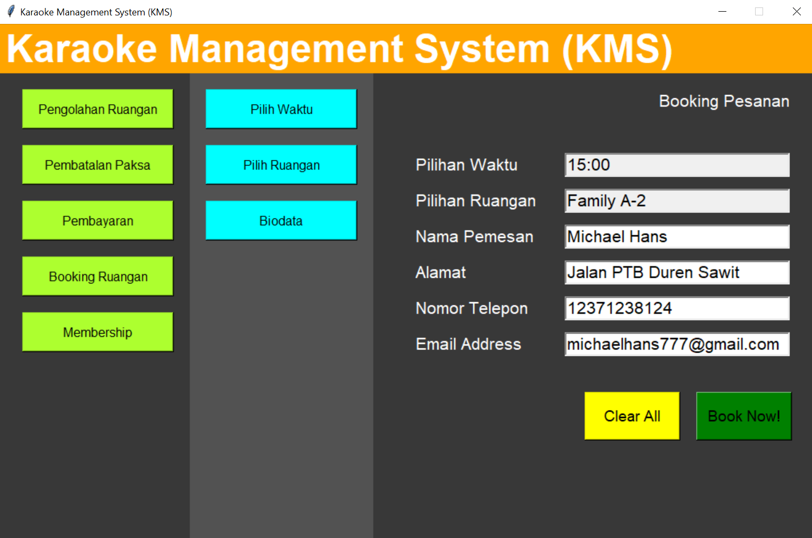

# Karaoke Management System


Karaoke Management System (KMS) merupakan aplikasi prototype yang dibuat untuk memenuhi kebutuhan dalam manajemen keuangan, pengelolaan, dan pemesanan ruangan berbasis IT. Dengan aplikasi KMS ini, diharapkan bisa menjadi sarana
untuk membantu manajemen pemesanan karaoke maupun pengolahan ruangan yang lebih terstruktur.

## Features
|No.  |  Features           |Penanggung Jawab               |
|-----|---------------------|-------------------------------|
|1.   |Pengolahan Ruangan   |13518104 - Kevin Austin Stefano|
|2.   |Pembatalan Pesanan   |13518128 - Lionnarta Savirandy |
|3.   |Pembayaran           |13518041 - Samuel      	    |
|4.   |Booking Pesanan      |13518056 - Michael Hans 	    |
|5.   |Membership           |13518077 - Filbert Wijaya      |

### Cara Menjalankan Program
Untuk menjalankan program, ketik command ini dalam directory `./src` sebagai berikut
```
python karaokeapp.py
```

## Cara Menjalankan Testing
Untuk menjalankan unit testing, ketik command ini dalam directory `./test` sebagai berikut
```
py.test
```
Untuk menjalankan unit testing secara spesifik, ketik command sebagai berikut.
```
py.test <NamaFileTest>
```

## Basis Data
Basis data yang kami gunakan adalah DatabaseKMS.sql yang terdiri atas 7 tabel, yaitu:
1.  DaftarPemesanan
2.  DaftarRuangan
3.  DataAdmin
4.  JenisRuangan
5.  Membership
6.  PembayaranMembership
7.  PembayaranPesanan
   
### 1. Daftar Pemesanan
| Field         | Type                       | Null | Key | Default | Extra |
|---------------|----------------------------|------|-----|---------|-------|
| id_pesanan    | int(11)                    | NO   | PRI | NULL    |       |
| nama          | varchar(50)                | YES  |     | NULL    |       |
| email         | varchar(50)                | YES  | MUL | NULL    |       |
| nomor_ruangan | int(11)                    | YES  | MUL | NULL    |       |
| tanggal       | date                       | YES  |     | NULL    |       |
| waktu_masuk   | time                       | YES  |     | NULL    |       |
| durasi        | int(11)                    | YES  |     | NULL    |       |
| harga_akhir   | int(11)                    | YES  |     | NULL    |       |
| is_bayar      | enum('BELUMBAYAR','LUNAS') | NO   |     | NULL    |       |

### 2. Daftar Ruangan
| Field      | Type        | Null | Key | Default | Extra          |
|------------|-------------|------|-----|---------|----------------|
| no_ruangan | int(11)     | NO   | PRI | NULL    | auto_increment |
| tipe       | varchar(50) | NO   | MUL | NULL    |                |
| username   | varchar(50) | NO   | MUL | NULL    |                |

### 3. Data Admin
| Field        | Type        | Null | Key | Default | Extra |
|--------------|-------------|------|-----|---------|-------|
| username     | varchar(50) | NO   | PRI | NULL    |       |
| password     | varchar(50) | NO   |     | NULL    |       |
| nama_lengkap | varchar(50) | NO   |     | NULL    |       |

### 4. Jenis Ruangan
| Field       | Type        | Null | Key | Default | Extra |
|-------------|-------------|------|-----|---------|-------|
| tipe        | varchar(50) | NO   | PRI | NULL    |       |
| kapasitas   | int(11)     | YES  |     | NULL    |       |
| hargaBiasa  | int(11)     | NO   |     | NULL    |       |
| hargaDiskon | int(11)     | YES  |     | NULL    |       |

### 5. Membership
| Field            | Type         | Null | Key | Default | Extra |
|------------------|--------------|------|-----|---------|-------|
| email            | varchar(50)  | NO   | PRI | NULL    |       |
| nama             | varchar(50)  | NO   |     | NULL    |       |
| umur             | int(11)      | NO   |     | NULL    |       |
| alamat           | varchar(100) | YES  |     | NULL    |       |
| telepon          | varchar(20)  | YES  |     | NULL    |       |
| paket_membership | varchar(50)  | YES  |     | NULL    |       |
| due_date         | date         | YES  |     | NULL    |       |

### 6. Pembayaran Membership
| Field         | Type        | Null | Key | Default | Extra |
|---------------|-------------|------|-----|---------|-------|
| email         | varchar(50) | NO   | PRI | NULL    |       |
| due_date_lama | date        | YES  |     | NULL    |       |
| due_date_baru | date        | YES  |     | NULL    |       |
| total_harga   | int(11)     | YES  |     | NULL    |       |

## Project Structure
Berikut ini adalah struktur folder dari Avatar Duel.
```
+---doc
+---src
|     bookingpesanan.py
|     membership.py
|     gui_bookingpesanan.py
|     gui_membership.py
|     gui_pembatalanpesanan.py
|     gui_pembayaran.py
|     gui_pengolahanruangan.py
|     karaokeapp.py
|     membership.py
|     pembatalanpesanan.py
|     pembayaran.py
|     pengolahanruangan.py
|
+---test
|     test_bookingpesanan.py
|     test_membership.py
|     test_pembatalanpesanan.py
|     test_pengolahanruangan.py
|
|   requirements.txt
|   .gitlab-ci.yml
\   README.md
```

## Author
IF2250 - Rekayasa Perangkat Lunak
Kelas K2 Kelompok 11 Tahun Ajaran 2019-2020
- 13518041 - Samuel
- 13518056 - Michael Hans
- 13518077 - Filbert Wijaya
- 13518104 - Kevin Austin Stefano
- 13518128 - Lionnarta Savirandy

## Acknowledgments
* Dosen IF2250 K2, Bpk. Wikan Danar Sunendyo
* Asisten Pembimbing, Vincent Marselino